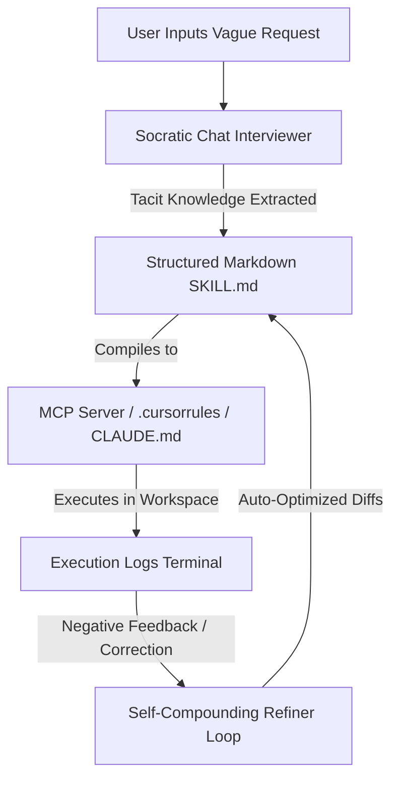
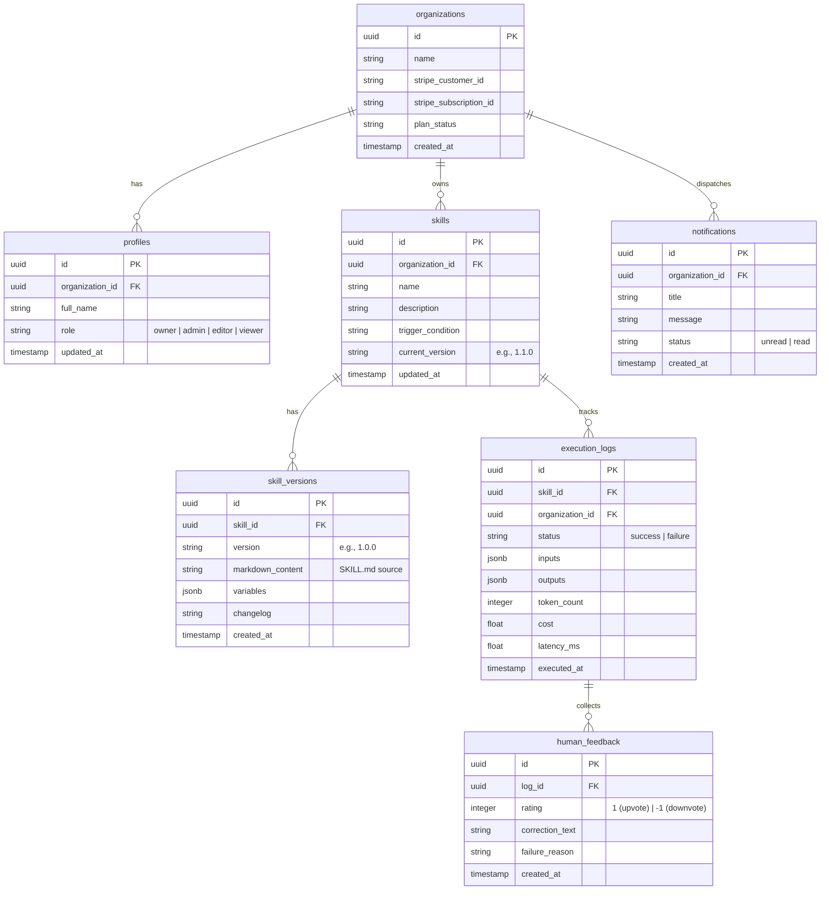

# Project Reference: Skill AI Factory

Skill AI Factory is a centralized enterprise-grade platform for creating, version-controlling, auditing, and executing **AI Skills** (repeatable, context-rich agent guidelines, prompts, and tool configurations). It bridges static business playbooks with an **active execution layer** that plugs directly into local IDEs, browser extensions, CLIs (like Claude Code), and external workflows via the Model Context Protocol (MCP).

---

## 1. Core Architecture & Moats

To guarantee long-term defensibility, the platform utilizes three self-compounding mechanisms:

1. **Socratic Tacit Knowledge Capture (Moat 1):** Interactive, AI-led conversational interviews to extract implicit developer judgment rules, edge cases, and success metrics that standard wikis miss.
2. **Self-Compounding Optimization Engine (Moat 2):** A closed-loop feedback pipeline where user ratings (upvotes/downvotes) and text corrections feed back into an asynchronous AI refiner to auto-update and optimize `SKILL.md` definitions over time.
3. **High-Switching-Cost Compiler (Moat 3):** Cross-compiling skill libraries into target formats (`.cursorrules`, `CLAUDE.md`, MCP JSON templates, and LangGraph schemas) to lock in the organization's entire AI workflow registry.

---

## 2. Technical Stack

| Layer | Technology | Details / Configuration |
| :--- | :--- | :--- |
| **Core Framework** | **Next.js 16 (App Router)** | Using React 19, TypeScript, and modern Server Components. |
| **Styling** | **Tailwind CSS v4** | Custom-curated dark mode HSL palettes with interactive micro-animations. |
| **Database** | **Supabase (PostgreSQL)** | Schema structure with row-level security (RLS) policies. |
| **Auth** | **Supabase SSR Auth** | Middleware-enforced session verification and org routing. |
| **Payments** | **Stripe** | Metred/hybrid billing sync + customer portals. |
| **AI Processing** | **Anthropic SDK** | Claude 3.5 Sonnet for Socratic interviews and refinement diffs. |
| **Notifications** | **Resend + Slack** | Transactional emails and webhook alerts on failed/low-rated logs. |

---

## 3. Database Schema

The database schema ([schema.sql](file:///c:/Users/Lalli_KK74/Desktop/AI%20Business%20Main%20Folder/Skill%20AI%20Factory/schema.sql)) uses logical multi-tenant isolation keyed by `organization_id`.

### Row Level Security (RLS) Policies
- All user-accessible tables have RLS enabled.
- Data queries are locked to the active user's `organization_id` (retrieved from `auth.jwt() -> user_metadata -> organization_id`).

---

## 4. API Reference Endpoints

### 1. Skills Management
- **`GET /api/skills`**: Lists all skills scoped to the current user's organization.
- **`POST /api/skills`**: Creates a new skill template.
- **`GET /api/skills/[id]`**: Retrieves skill meta-data.
- **`PATCH /api/skills/[id]`**: Updates skill fields or compiles a new version version.

### 2. Socratic Interviewer
- **`POST /api/ai/interview`**: Initiates or advances the Socratic interview stream. Connects to Anthropic Claude 3.5 Sonnet to prompt the user for edge cases, metrics, and configurations, outputting structured JSON updates.

### 3. Feedback Loop & Optimization
- **`POST /api/ai/refine`**: Feedback Optimization endpoint. Gathers low-rated logs (`rating = -1`) and text corrections, runs a Claude prompt to analyze failures, and outputs a formatted Markdown diff to refine the `SKILL.md` checklist.
- **`POST /api/logs/[id]`**: Saves logs upvotes/downvotes, text corrections, and triggers Slack channel notifications via the [notifier.ts](file:///c:/Users/Lalli_KK74/Desktop/AI%20Business%20Main%20Folder/Skill%20AI%20Factory/lib/notifier.ts) utility upon failure events.

### 4. Model Context Protocol (MCP) Server
- **`GET/POST /api/mcp`**: Exposes the library as a standard MCP compliant endpoint.
  - Lists prompts/tools corresponding to active skills.
  - Translates skills execution runs to API calls, allowing Cursor/VS Code IDEs to fetch and execute updated checklist definitions directly.

### 5. Stripe Billing
- **`GET /api/billing/checkout`**: Directs to Stripe Checkout session.
- **`GET /api/billing/portal`**: Directs to self-serve Stripe Customer billing portal.
- **`POST /api/webhooks/stripe`**: Syncs subscription status changes and logs usage parameters.

---

## 5. Architectural & Design Decisions

### 1. Build-Time vs. Run-Time Environment Variable Safe-guards
- **Problem:** Database client and Stripe initializations originally verified environment variables at module load time. This caused compilation crashes when Vercel ran static route prerendering.
- **Resolution:** Updated clients to load keys dynamically or fall back to placeholders (`https://placeholder.supabase.co`) during build time, ensuring compile reliability.

### 2. TypeScript Const Declarations for Anthropic Message Roles
- **Problem:** Anthropic Node SDK requires exact const literal types (`'user' | 'assistant'`) for the messages structure. Passing general string maps failed TypeScript compiler checks.
- **Resolution:** Explicitly cast role transformations (e.g., `role: item.role as 'user' | 'assistant'`) inside the Socratic `/api/ai/interview` route.

### 3. Socratic Interview Bypass (Structured Editor)
- **Problem:** If external APIs (like Anthropic) fail or run out of credits, users shouldn't be locked out of creating/editing skills.
- **Resolution:** Implemented a split UI panel where users can bypass the conversational chat and manually key in Trigger Conditions, Instructions, Constraints, and checklists directly into form fields to save.

---

## 6. Implementation Status

| Component | Status | Verification Notes |
| :--- | :--- | :--- |
| **Next.js & Routing Layouts** | **Complete** | Compiles cleanly with zero types/linter errors. |
| **Git Repository** | **Complete** | Synced to `https://github.com/KishoreKaathvi/skill-ai-factory` (tracked on `master`). |
| **Cloud Database (Supabase)** | **Complete** | Initialized on `https://ddlbqiqkjhombrfmoywx.supabase.co`. SQL schema active. |
| **Local Config (`.env.local`)** | **Complete** | Created locally and populated with keys. Dev server running on `http://localhost:3000`. |
| **Stripe Checkout & Portal** | **Complete** | API paths created; supports test mode. |
| **Transactional Notifications** | **Complete** | SMTP / Webhook delivery helper implemented in `lib/notifier.ts`. |
| **E2E Browser Validation** | **Complete** | Completed journey: Signup → Gmail validation → Login → KPI inspection → Manual Skill creation → Logs Terminal check. |
| **Socratic Interview / Refinement** | **Pending API Credits** | API structures fully written, but requires adding credits to your Anthropic API Key (`sk-ant-...`) to function. |

---

## 7. Next Steps & Recommended Path

1. **Top Up Anthropic API Key:**
   - Log into your Anthropic Developer Console and add credit balance to the active key. This will instantly activate the Socratic Chat drawer and the feedback Refiner optimizer.
2. **Deploy to Vercel Cloud:**
   - Connect the [KishoreKaathvi/skill-ai-factory](https://github.com/KishoreKaathvi/skill-ai-factory) repository directly inside Vercel.
   - Inject the environment variables from your local `.env.local` file into the Vercel Project Settings.
3. **Configure Stripe Webhooks in Production:**
   - Set up your Stripe endpoint listening to Vercel's production URL (`https://your-domain.vercel.app/api/webhooks/stripe`) to synchronize active subscription statuses.
